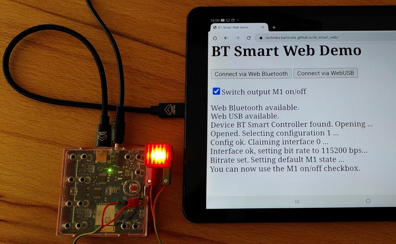

# BT Smart Web

Demo controlling the [fischertechnik BT smart controller](https://www.fischertechnik.de/de-de/produkte/einzelteile/aktoren/161944-bt-smart-controller-rot) from within a browser via Web Bluetooth and/or Web USB.

To run this demo open the following link using google chrome:

https://technika-karlsruhe.github.io/bt_smart_web/

This demo has been tested under Windows, Linux and Android.

## Windows

The Web Bluetooth part should work on Windows out of the box. Web USB
may need some help. If the attempt to use Web USB ends with a
"Access Denied" error, the WinUSB driver may not ba assigned to
the BT Smart Controller. The [Zadig tool](https://zadig.akeo.ie/)
will probably be able to solve this. Use the tool to search for the
"BT Smart Controller" use it to replace the exiting driver with
WinUSB driver. Afterwards the Web USB part should work as well.

The original driver and the COM port are not associated with
the board afterwards. Re-installing the driver in the system settings
will restore the original default driver and restore the COM port.

## Linux

Under Ubuntu Linux the Chrome/Chromium is by default installed from a snap archive and is by default sandboxed. It thus doesn't have the necessary permissions to access USB. The following command allows for raw USB access from within Chrome/Chromium:

```
sudo snap connect chromium:raw-usb
```

Furthermore direct USB permissions may need to be given to the current user. Creating a file named ```/etc/udev/rules.d/99-btsmart.rules``` containing the following line will give the necessary permissions.

```
ATTRS{idVendor}=="221d" ATTRS{idProduct}=="0005", MODE="664", GROUP="plugdev"
```

## Android

The demo runs out of the box with the chrome preinstalled on any recent android device. However, for the USB version to work a so-called "USB to mini USB host mode cable" or "USB on-the-go (OTG) to mini USB adapter" is needed. This cable should have a connector matching your Android device on one side (e.g. USB-C on recent phones) and a Mini-USB connector on the other side matching the BT Smart controller.

